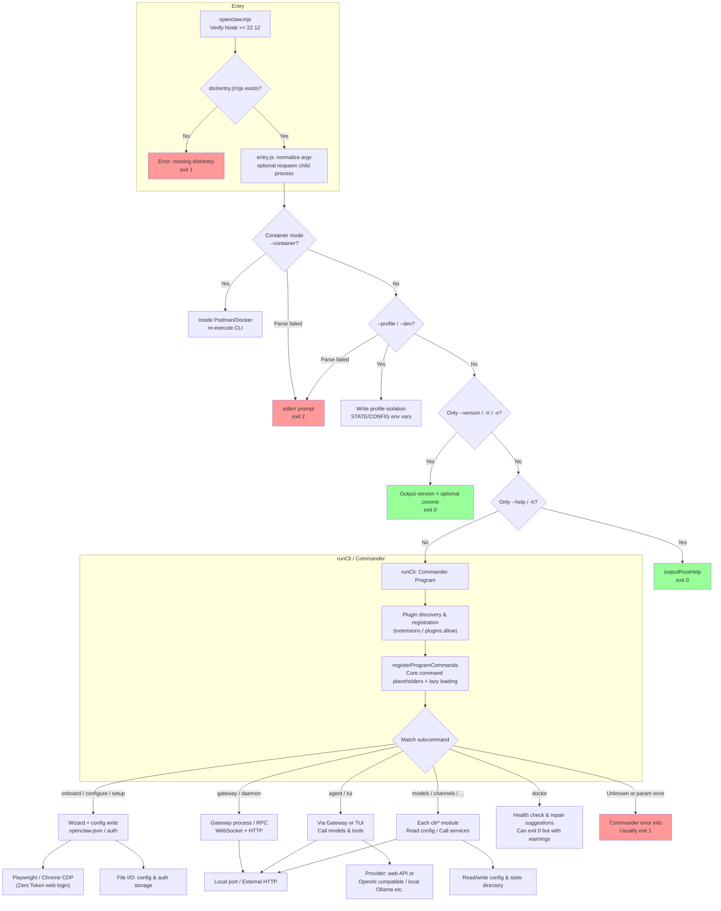

# OpenClaw / openclaw-zero-token CLI Architecture Flow

This document describes the main path from **command line entry** to **subcommand execution** in this repository, for reference against the source code (`openclaw.mjs`, `entry.ts`, `cli/`). For the upstream OpenClaw high-level architecture overview, see the root `ARCHITECTURE.md`.

## Diagram Notes

- **Solid lines**: main flow; **Dashed lines**: on-demand loading (lazy subcommand registration) or async branches.
- **Exit codes**: `0` success; `1` general error (validation failure, runtime failure); `2` root-level argument parsing error (e.g., invalid `--container` / `--profile` combination); if Node version is too low, `openclaw.mjs` directly calls `exit(1)`.
- **Zero Token**: `onboard` / `configure` and similar flows can trigger `src/zero-token/providers/*` with Playwright/CDP to send requests to various vendors' **web APIs**; credentials are saved as `auth.json` etc. in the state directory (do not commit to version control).

## Source Code Map

| Phase | Main File |
| ------------------------- | ---------------------------------------------------------------------- |
| Bootstrap wrapper | `openclaw.mjs` |
| Process entry, version/help fast path | `entry.ts` |
| CLI main loop | `cli/run-main.ts` → `cli/program/*` |
| Core subcommand registration | `cli/program/command-registry.ts` |
| Extension subcommands | `cli/program/register.subclis.ts`、`cli/program/subcli-descriptors.ts` |
| Zero Token web side | `src/zero-token/providers/`、`src/zero-token/streams/` |
